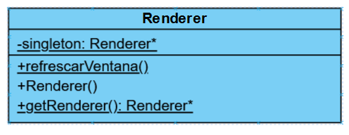

En nuestra aplicación debería haber una clase PAG::Renderer que se encargue de
encapsular todo lo relativo al dibujado de la escena 3D en el contexto gráfico OpenGL.
Esa clase debería tener un método llamado refrescarVentana() que debería llamarse
cada vez que la ventana deba redibujarse. El problema es que no podemos registrar
como callback para el evento window_refresh al método
PAG::Renderer::refrescarVentana(), ya que no podemos registrar como
callbacks métodos de clases, sino funciones sencillas de C.
¿Cómo solucionar este problema? ¿Cómo podemos llamar desde nuestras funciones
callback en C a los métodos de la clase PAG::Renderer que responden a los distintos
eventos? Todo ello habría de hacerse de la forma más encapsulada (es decir menos
acoplada) posible.

Pistas para plantear la solución:
  
-  ¿Cómo debería declararse el objeto de la clase PAG::Renderer que actúa como renderer de la aplicación?
-  ¿Qué módulo de la aplicación debería inicializarlo?
---
Para registrar la función PAG::Renderer::refrescarVentana() como callback deberiamos implementarla como un metodo de la propia clase a través del uso de la keyword "static", 
lo que a su vez implicaría, también por conveniencia, que la clase PAG::Renderer sería diseñada como un singleton, ya que solo necesitariamos una instancia de esta para nuestra aplicación.

La representación UML de la clase Renderer sería la siguiente:

 
