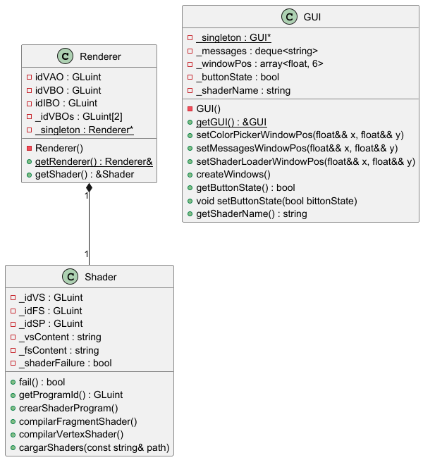

## Práctica 1 ##

En nuestra aplicación debería haber una clase PAG::Renderer que se encargue de
encapsular todo lo relativo al dibujado de la escena 3D en el contexto gráfico OpenGL.
Esa clase debería tener un método llamado refrescarVentana() que debería llamarse
cada vez que la ventana deba redibujarse. El problema es que no podemos registrar
como callback para el evento window_refresh al método
PAG::Renderer::refrescarVentana(), ya que no podemos registrar como
callbacks métodos de clases, sino funciones sencillas de C.
¿Cómo solucionar este problema? ¿Cómo podemos llamar desde nuestras funciones
callback en C a los métodos de la clase PAG::Renderer que responden a los distintos
eventos? Todo ello habría de hacerse de la forma más encapsulada (es decir menos
acoplada) posible.

Pistas para plantear la solución:
  
-  ¿Cómo debería declararse el objeto de la clase PAG::Renderer que actúa como renderer de la aplicación?
-  ¿Qué módulo de la aplicación debería inicializarlo?
---
Para registrar la función PAG::Renderer::refrescarVentana() como callback deberiamos implementarla como un metodo de la propia clase a través del uso de la keyword "static", 
lo que a su vez implicaría, también por conveniencia, que la clase PAG::Renderer sería diseñada como un singleton, ya que solo necesitariamos una instancia de esta para nuestra aplicación.

La representación UML de la clase Renderer sería la siguiente:

 

---
## Práctica 2 ##

Durante esta sesión de prácticas hemos incorporado dos nuevas clases, Renderer que se encargara
de dibujar todo los modelos en escena a traves de Opengl, y GUI que utilizara  la biblioteca ImGui, 
con la cual hemos logrado la implementación de una interfaz simple que nos permite capturar los 
mensajes que previamente se mostraba por consola, en una pequeña ventana, y elegir el color del 
fondo de nuestra aplicación.

Para ello  nuestra propia clase GUI, que encapsula todas las funcionalidades que necesitamos de 
dicha biblioteca, sera diseñada con el patrón de diseño singleton al igual que la clase Renderer,
y se encontrará en el espacio de nombres PAG. Esta clase como hemos indicado en el parrafo anterior
implementará dos ventanas a través de la función ImGui::Begin(), la primera funcionará como una consola, ya que mostrara
los mensajes de nuestra aplicación a través de la función ImGui::Text(), que permite mostrar texto en 
la ventana o contexto determinado. En la segunda ventana utilizaremos otro recurso diractemente implementado 
en la biblioteca, el cual es un selector de color, accesible a traves de la función ImGui::ColorPicker4(), el cual mostrara
los valores RGB, HSV y hexadecimal del color selecionado gracias a las etiquetas utilizadas en la función, que también
permiten no mostrar el valor de transparencia del color y seleccionar el formato con el que se muestra el selector de color.

---

Para cumplir ese proposito, la clase tiene todos los atributos y metodos necesarios, entre ellos:
#### atributos ####

- `std::deque<std::string> _messages;` &emsp; &emsp; todos los mensajes obtenidos para mostrar.
- `std::array<float, 4> _windowsPos;` &emsp; &emsp; &nbsp; las posiciones de las dos ventanas.
- `std::array<float, 4> _windowsSize;` &emsp; &emsp; el tamaño de las dos ventanas.
- `ImVec4 _colo;r` &emsp; &emsp; &emsp; &emsp; &emsp; &emsp; &emsp; &emsp; &emsp;&emsp; el color seleccionado con el selector de color.

#### métodos ####
- `void init();`   Inicializa todos los recursos necesarios para el funcionamiento de dear ImGui.
- `void newFrame();`   Indica que se comienza un nuevo frame a dear ImGui para renderizar la interfaz.
- `void render();`   Dibuja toda la interfaz previamente inicializada.
- `void addMessage(const std::string& newMessage);`   Añade un nuevo mensaje a mostrar a la pila de mensajes.
- `void freeResources();`   Libera los recursos de dear ImGui antés de que la aplicación finalice.
- `void setWindowsPos(float&& x1, float&& y1, float&& x2, float&& y2);`   Define la posicion de las ventanas creadas.
- `void setWindowsSize(float&& w1, float&& h1, float&& w2, float&& h2);`   Define el tamaño de las ventanas creadas.
- `void createWindows();`   Crea las ventanas de la interfaz, siendo la primera de estas la salida de los mensajes de nuestra aplicación, y la segunda
el selector de color del fondo de la aplicación.

---

Ya que hemos cubrido la clase que cumple el papel de interfaz en nuestra aplicación, comenzaremos explicando brevemente la clase que
se encarga de dibujar los modelados a través de Opengl, la clase Renderer. La clase seguira el mísmo patrón de diseño que la clase anterior
y solo incluira la biblioteca GLAD.h para así mantener una estructura modular en el proyecto. 

---

Entre lo más destacado, la clase se ocupa de inicializar Opengl y del renderizado del color de fondo, 
que para ello requiere de los siguientes métodos y atributos:

#### atributos ####

- `glm::vec4 _clearColor;` &emsp; &emsp; &emsp; &emsp; &emsp; &emsp; El color con el que pintar el fondo de la aplicación.

#### métodos ####
- `void init();`   Inicializa todos los recursos necesarios para el funcionamiento de Opengl.
- `void refrescar();`   Dibuja la escena a través de Opengl, en este caso el color de fondo.
- `void ratonRueda(double xoffset, double yoffset);`   El callback que baja la tonalidad del color de fondo a traves de la rueda del ratón.
- `void tamanoViewport(int width, int height);`   El callback que permite cambiar el tamaño del viewport cuando cambia el tamaño de la ventana de la aplicación.
- `std::string getInforme();`   Interroga a Opengl para obtener un informe sobre la GPU del dispositivo.

---

Cabe destacar que para que las utilidades de ambas clase funcionen de forma correcta, es necesario que estas comuniquen entre si el color con el que 
se esta dibujando.

---

## Práctica 3 ##

En esta sesión de prácticas hemos conseguido dibujar un triángulo con un color distinto en cada vertice a través de las funciones otorgadas
por Opengl, para ello también hemos tenido que crear archivos glsl para la compilción de los shaders que son utilizados en el dibujado del modelado.

---

Las funciones que hemos creado en nuestra clase Renderer para desempeñar dichas acciones son las siguientes:

`void obtenerShaders(const std::string& path);` 

Función que lee los archivos pasados por parametro para obtener los shaders con los que se renderizará el modelo.

`void creaShaderProgram();`

Función que crea los dos shaders, el vertex shader y el fragment shader, compilandolos y enlazandolos en un programa para su posterior uso,
comprobando que no se ha producido ningún error en el proceso, y en el caso de que se produjese, informarlo a través de la ventana de mensajes.

`void creaTriangulo();`

Hace uso de los VAO (Vertex Array Object), VBO (Vertex Buffer Object), IBO (Index Buffer Object) de Opengl para la creación del triángulo.
Esta formado por un VBO entrelazado donde se encuentran las coordenadas y color de los vertices a dibujar, y un IBO donde se encuentra la topología 
del modelo, ambos buffers perteneciendo al mismo VAO.

---

### Ejercicio 5 ###

Responde a esta pregunta. Si redimensionas la ventana de la aplicación, verás que el triángulo
no permanece igual, sino que se deforma al mismo tiempo que la ventana. ¿A qué crees que se
debe este comportamiento?

- El efecto se debe a que cuando redimensionamos la ventana, estamos redimensionando exclusivamente el viewport de la escena, no
el tamaño de la vista de la cámara, para arreglar esto, tendriamos que manipular también la vista de la cámara de manera proporcional
a la de la ventana y viewport.

---

## Práctica 4 ##

En esta sesión de practicas hemos desacoplado la funcionalidad de shader de la clase Renderer, haciendo así nuestra
propia clase Shader, que por ahora se encargará de gestionar programas de shader muy simplificados, compuestos unicamente
por vertex shaders y fragment shaders.

A lo largo de que se desarrollen las practicas futuras, la clase Shader seguirá siendo cambiada para implementar las funciones más
complejas y, posiblemente, se implementará otra clase ShaderProgram que es la que se encargará de enlazar los shader, haciendo
la clase Shader más especializada en la gestión de los contenidos de los shaders como tal.

---

La clase Shader esta formada por los siguientes métodos y atributos:

#### atributos ####

- `GLuint _idVS;` &emsp; &emsp; &emsp; &emsp; &emsp; &emsp; Identificador del vertexShader.
- `GLuint _idFS;` &emsp; &emsp; &emsp; &emsp; &emsp; &emsp; Identificador del fragmentShader.
- `GLuint _idPS;` &emsp; &emsp; &emsp; &emsp; &emsp; &emsp; Identificador del programa de shaders.
- `std::string _vsContent;`&emsp;&emsp;&emsp;Contenido del vertexShader.
- `std::string _fsContent;`&emsp;&emsp;&emsp;Contenido del fragmentShader.
- `bool _shaderFailure;`  &emsp;&emsp;&emsp;&emsp; Indica si ha habido algun error en la creción del programa de shaders.

#### métodos ####
- `void cargarShaders(const std::string& path);`   Obtiene el codigo de los shaders dados en la variable path.
- `void compilarVertexShader();`   Compila el vertexShader.
- `void compilarFragmentShader();`   Compila el fragmentShader.
- `void crearShaderProgram();`   Crea y enlaza el shaderProgram con los shaders.
- `GLuint getProgramID();`   Devuelve el id del programa de shaders.
- `bool fail();`   Indica si se ha producido algún error.

---

Con lo dicho anteriormente, se mostrará un esquema uml de como que la estructura de las clases creadas tras el desacoplamiento de
la clase Shader.

---

## Práctica 5 ##

En esta sesión de prácticas hemos implementado una cámara con la capacidad de ser controlada a través de una interfaz creada
por nuestra clase GUI. También, a lo largo de esta sesión he creado una mejor implementacion de los shaders, formando dos clases:
ShaderProgram y Shader, para incrementar la flexibilidad de dicha implementación en nuestra aplicación.

Nuestra clase Camera tiene los atributos necesarios para el cálculo de la matríz de visión y las dos matrices de proyección, la matríz proyección
ortográfica y la matríz proyección perspectiva:

#### atributos ####

- `float _zNear;`   Plano cercano de vision (si un modelo o parte de este se encuentra mas cerca de la camara que el este plano, el modelo a la parte no será renderizado).
- `float _zFar;`   Plano lejano de vision (si un modelo o parte de este se encuentra mas lejos de la camara que el este plano, el modelo a la parte no será renderizado).
- `float _angle;`   Ángulo de visión de la cámara (solo pertenece a la proyección perspectiva).
- `float _scope;`   Aspecto de la visión de la cámara (proporción entre el ancho y largo del plano de visión de la cámara, solo pertenece a la proyección perspectiva).
- `float _left;`   Plano izquierdo del prisma rectangular de visión de la cámara (solo pertenece a la proyección ortográfica).
- `float _right;`   Plano derecho del prisma rectangular de visión de la cámara (solo pertenece a la proyección ortográfica).
- `float _top;`   Plano superior del prisma rectangular de visión de la cámara (solo pertenece a la proyección ortográfica).
- `float _botton;`   Plano inferior del prisma rectangular de visión de la cámara (solo pertenece a la proyección ortográfica).
- `glm::vec3 _position;`   Posición de la cámara.
- `glm::vec3 _upVec;`   Vector que indica la orientación de la cámara.
- `glm::vec3 _target;`   Posición a la que apunta la cámara.

Entre sus métodos más importantes encontramos:

#### métodos ####

- `const glm::mat4 getOrthographicProjection() const;`   Devuelve la matríz de proyección ortográfica.
- `const glm::mat4 getPerspectiveProjection() const;`   Devuelve la matríz de proyección perspectiva.
- `const glm::mat4 getVision() const;`   Devuelve la matríz de visión.
- `void tilt(float angle);`   Gira la cámara según su vector derecha (dado por: _upVec x (_position - _target)).
- `void pan(float angle);`   Gira la cámara según su vector arriba.
- `void dolly(float xMovement, float zMovement);`   Mueve la cámara en el plano XZ del sistema de coordenadas de la escena.
- `void orbit(float xAngle, float yAngle);`   Mueve la cámara orbitando el objetivo según su vector arriba y derecha.
- `void crane(float yMovement);`   Mueve la cámara en el eje Y del sistema de coordenadas de la escena.
- `void zoom(float angle);`   Incrementa o decrementa el zoom de la cámara.

---

Para la correcta implementación de la interfaz que permita seleccionar el movimiento de la cámara, ha sido necesario crear un enum indicando
el tipo de movimiento que se quiere que la cámara haga. Comunicando dicho movimiento seleccionado entre la clase Renderer y la clase GUI.

Con ese propósito también hemos tenido que implementar una nueva ventana en la clase GUI, con la que puedes indicar el movimiento y la proyección
que se deseé utilizar en la cámara.

---

### Controles de la cámara ###

Para utilizar la cámara en su totalidad lo primero es cargar los shaders con el nombre "pag05", los cuales son los archivos shader que calculan la posición
teniendo en cuenta las matrices de proyección y vista de la cámara.

#### Movimientos ####

Para utilizar los movimientos tienen que ser seleccionados en la ventada "camara" de la interfaz y mantener presionado el click izquierdo del ratón o utilizar los controles que otorga
la propia interfaz. 

- Tilt:
  - Mantener presionado el click izquierdo del ratón y mover arriba o abajo para girar la cámara en esas direcciones respectivamente.
  - Pulsar "UP" o "DOWN" para girar de la mísma mánera.
- Pan: 
  - Mantener presionado el click izquierdo del ratón y mover derecha o izquierda para girar la cámara en esas direcciones respectivamente.
  - Pulsar "LEFT" o "RIGHT" para girar de la mísma mánera.
- Dolly: 
  - Mantener presionado el click izquierdo del ratón y mover arriba, abajo, derecha o izquierda para mover la cámara hacia adelante, atras, derecha o izquierda respectivamente.
  - Pulsar "FORWARD", "BACKWARD", "RIGHT" o "LEFT" para mover de la mísma mánera.
- Crane: 
  - Mantener presionado el click izquierdo del ratón y mover arriba o abajo para mover la cámara hacía arriba o abajo.
  - Pulsar "UP" o "DOWN" para mover de la mísma mánera.
- Orbit: 
  - Mantener presionado el click izquierdo del ratón y mover arriba o abajo para cambiar la latitud de la cámara al orbitar el objetivo al que está apuntando, y derecha o izquierda para la longitud.
  - Pulsar "UP", "DOWN", "LEFT" o "RIGHT" para girar de la mísma mánera respecto al objetivo.
- Zoom: 
  - Mantener presionado el click izquierdo del ratón y mover derecha o izquierda para incrementar o decrementar el zoom de la cámara.
  - Utilizar la barra para manipular el ángulo de visión de la cámara.

---

El siguiente diagrama UML muestra la estructura de las clases creadas hasta ahora:

